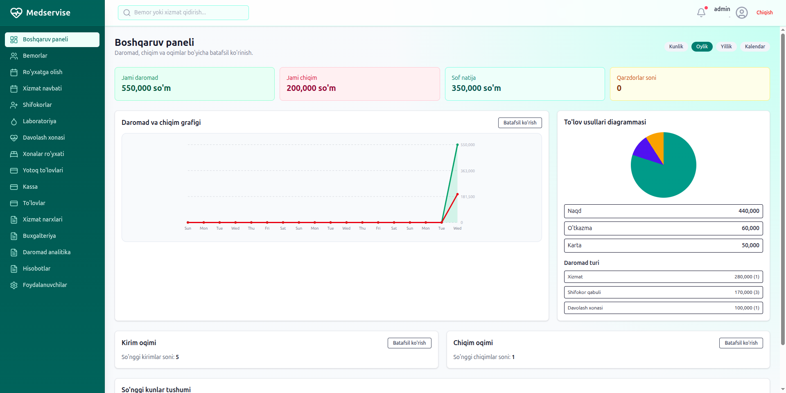
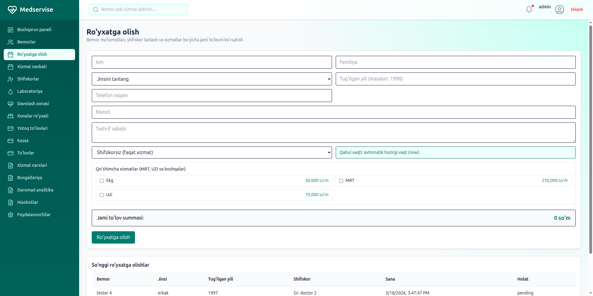
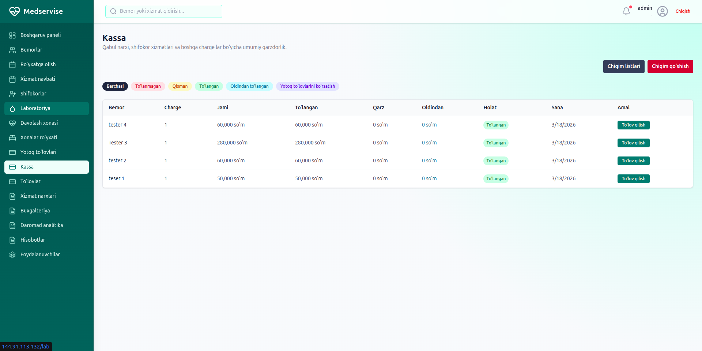
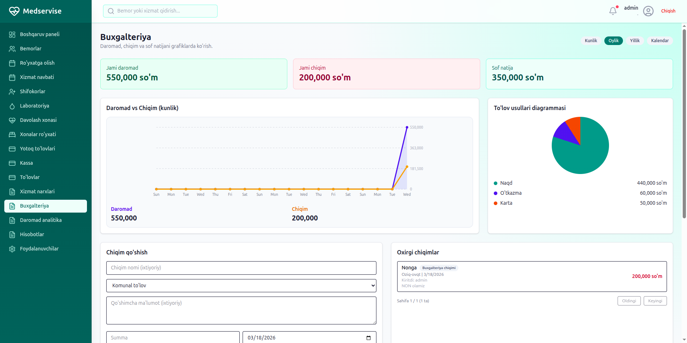

# Medservice Management System v2

Medservice is a modular clinic management platform for private clinics and branches.

This repository includes:
- `backend/` Django + DRF API
- `src/` React + TypeScript frontend
- `docker-compose.prod.yml` production stack (`nginx + backend + postgres`)
- `.github/workflows/` CI/CD pipelines

## Highlights
- Modular architecture by domain apps (`accounts`, `patients`, `appointments`, `billing`, `reports`, ...)
- Real clinic workflow support:
  registration -> appointment -> examination -> referral/lab -> payment -> reporting
- Role-based access and page permissions
- Billing flows for cashier and treatment room payments
- Receipt printing support
- Daily treatment charge automation with scheduler
- Production-ready Docker deployment

## Tech Stack
- Backend: Django, DRF, PostgreSQL, SimpleJWT
- Frontend: React, TypeScript, Vite
- Infra: Docker, Docker Compose, Nginx
- CI/CD: GitHub Actions

## Quick Start (Local)
```bash
# backend
cd backend
python3 -m venv ../.venv
../.venv/bin/pip install -r requirements.txt
cp .env.example .env
../.venv/bin/python manage.py migrate
../.venv/bin/python manage.py seed_roles
../.venv/bin/python manage.py runserver
```

```bash
# frontend (from project root)
npm ci
npm run dev
```

## Production Deploy
Use `docker-compose.prod.yml` on your server:
```bash
docker compose -f docker-compose.prod.yml up -d --build
docker compose -f docker-compose.prod.yml exec backend python manage.py migrate
docker compose -f docker-compose.prod.yml exec backend python manage.py collectstatic --noinput
```

Detailed deployment guide:
- [backend/README_MEDSERVICE.md](backend/README_MEDSERVICE.md)

## CI/CD
- CI: frontend build + backend checks
- CD: deploys `main` branch to server over SSH

Required GitHub Secrets:
- `PROD_HOST`
- `PROD_USER`
- `PROD_SSH_KEY`
- `PROD_PROJECT_DIR` (optional, defaults to `/opt/medservice`)

## Screenshots
Add project screenshots to make the repository profile stronger.

Suggested files:
- `docs/assets/dashboard.png`
- `docs/assets/registration.png`
- `docs/assets/cashier.png`
- `docs/assets/reports.png`

Example markdown (update after you add images):
```md




```

## Project Owner (Resume Style)
**Role:** Full-Stack Developer  
**Project:** Medservice Management System v2  
**Focus:** Scalable clinic workflow platform with modular architecture and production deployment

### Key Contributions
- Designed modular backend architecture with Django apps by domain
- Implemented billing/payment workflows and receipt printing flows
- Built service queue and registration workflow improvements
- Added production Docker deployment (`nginx + backend + postgres`)
- Configured CI/CD with GitHub Actions for automated deploys

### Operational Skills Demonstrated
- API design and backend service layering (`services.py`, `selectors.py`)
- Frontend feature delivery with React + TypeScript
- Linux server operations, Docker, Nginx, PostgreSQL
- Secure secret handling and SSH-based deployment automation

## Project Status
Active development. Production deployment and automated pipelines are configured.

## Author
Maintained by the Medservice team.
